# Setup

```
compile 'com.jakewharton.timber:timber:4.5.1'
compile 'com.facebook.stetho:stetho:1.5.0'
// Depend on your network
compile 'com.facebook.stetho:stetho-okhttp3:1.5.0'
// or
compile 'com.facebook.stetho:stetho-okhttp:1.5.0'
// or
compile 'com.facebook.stetho:stetho-urlconnection:1.5.0'
// for use javascript console
compile 'com.facebook.stetho:stetho-js-rhino:1.5.0'
```

```java
[MainApplication.class]
public class MainApplication extends BaseApplication{

    @Override
    public void onCreate(){
        super.onCreate();
        Timber.plant( new DebugTree() );

        Stetho.initialize(
                Stetho.newInitializerBuilder( this )
                        .enableWebKitInspector(
                                () -> new Stetho.DefaultInspectorModulesBuilder( MainApplication.this )
                                        .runtimeRepl(
                                                new JsRuntimeReplFactoryBuilder( MainApplication.this )
                                                        .addVariable( "foo", "Assign to foo variable" )
                                                        .build()
                                        ).finish() )
                        .enableDumpapp(
                                () -> new Stetho.DefaultDumperPluginsBuilder( MainApplication.this )
                                        .provide( new HelloWorldDumperPlugin() )
                                        .finish() )
                        .build()
        );
    }
}
```

# 1. UI Debugging

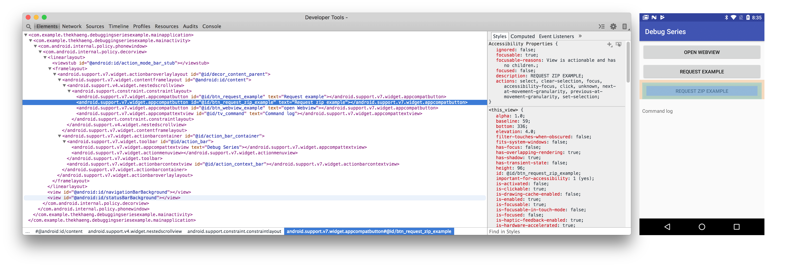

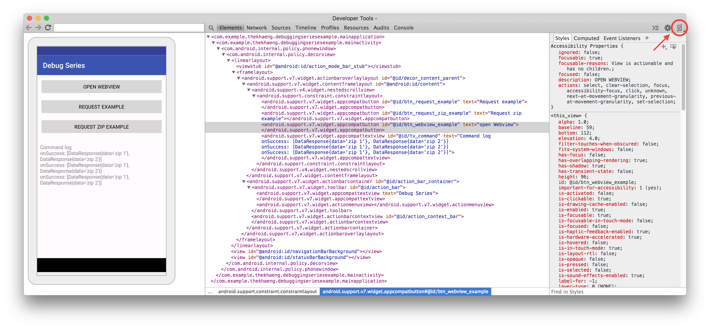

# 2. Network Debugging

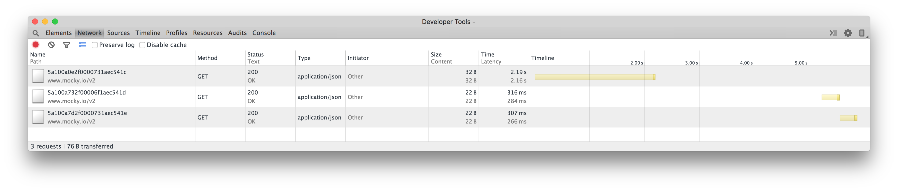

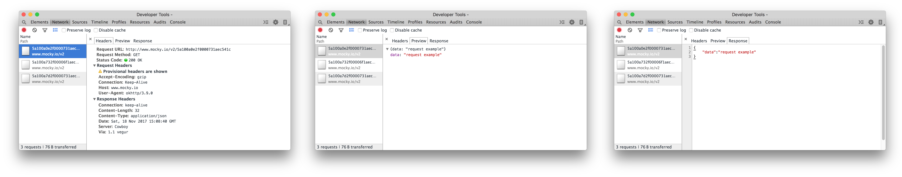

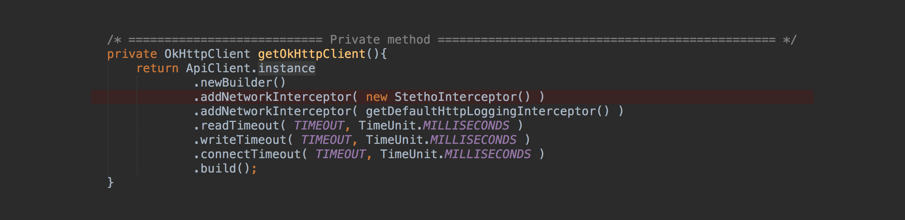

# 3. Resource Debugging

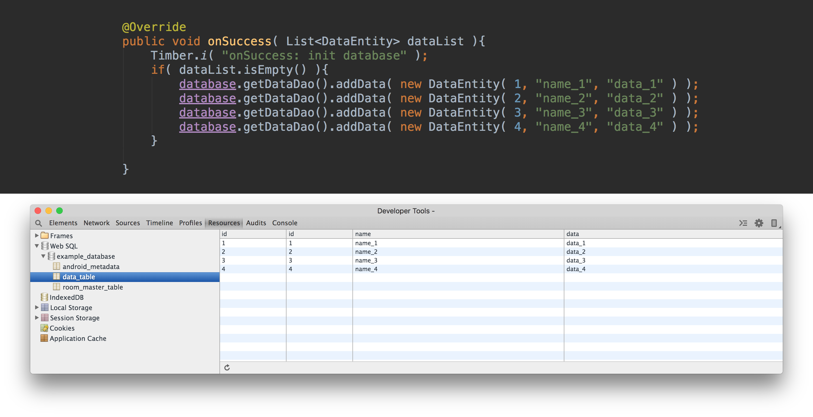

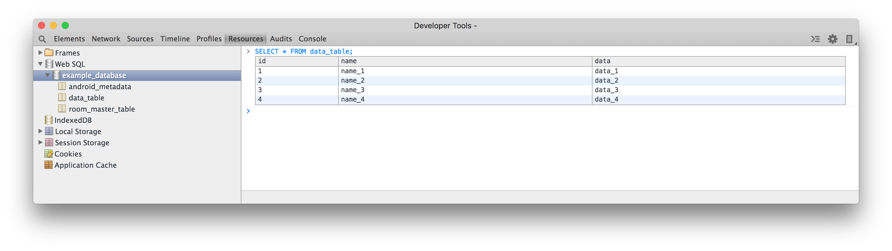


# 4. Javascript Console

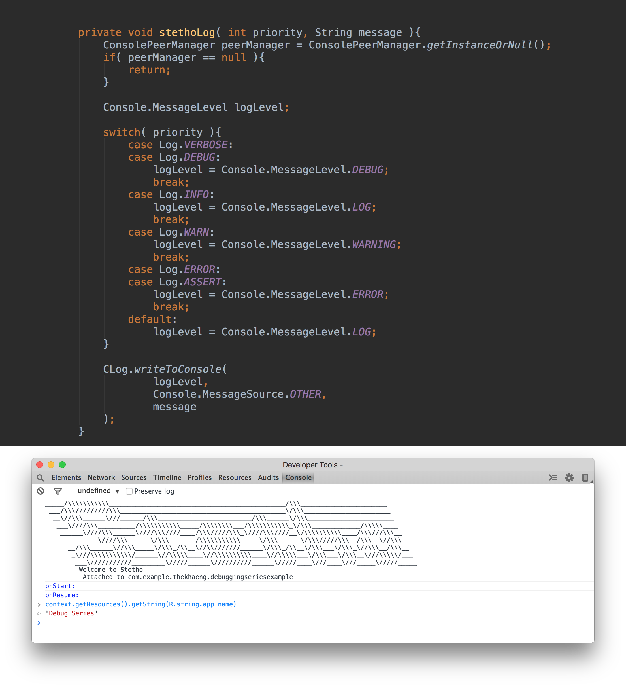

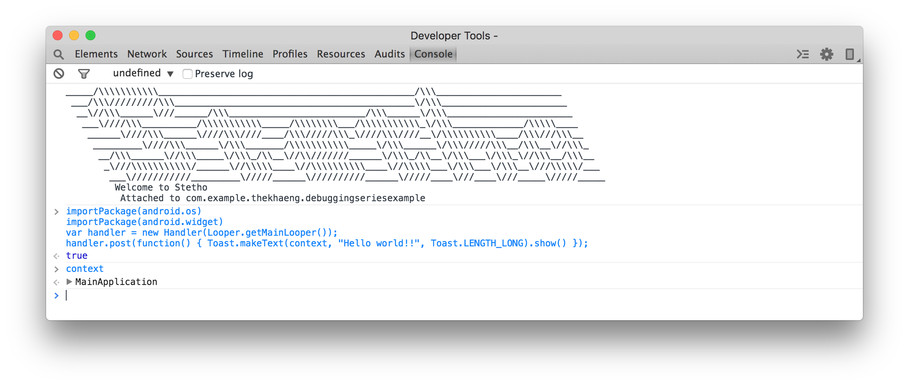

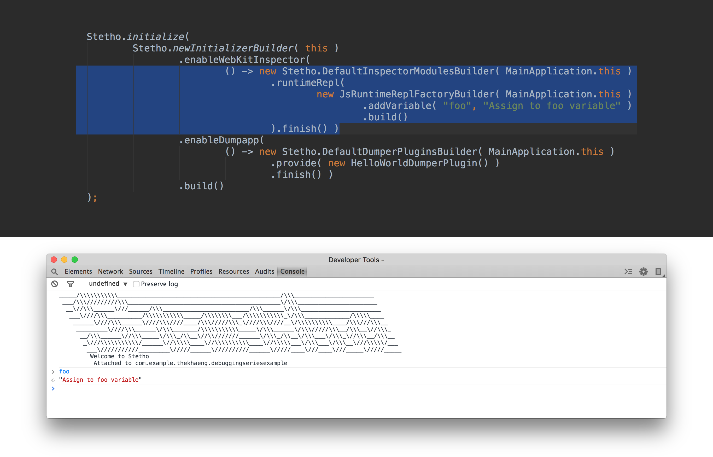

# 5. dumpapp

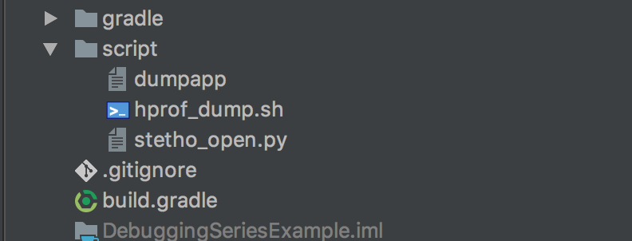


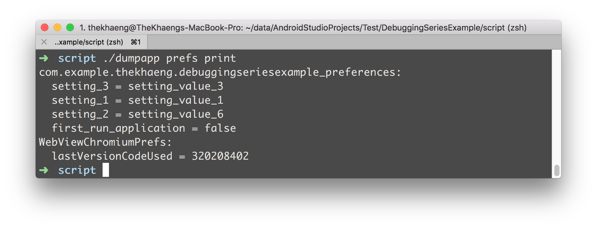

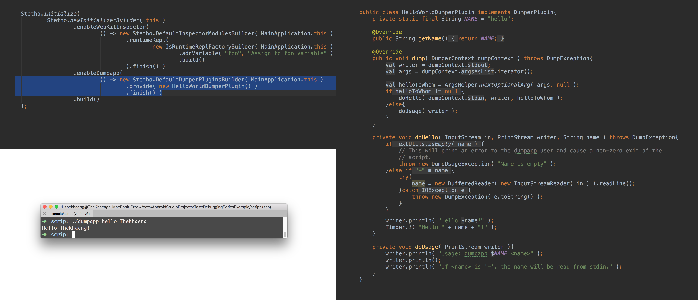


# Webview debugging

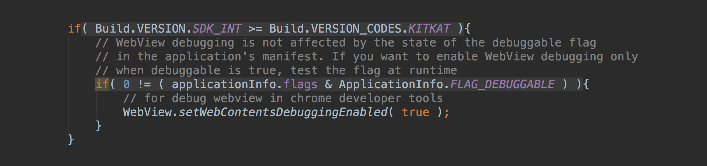

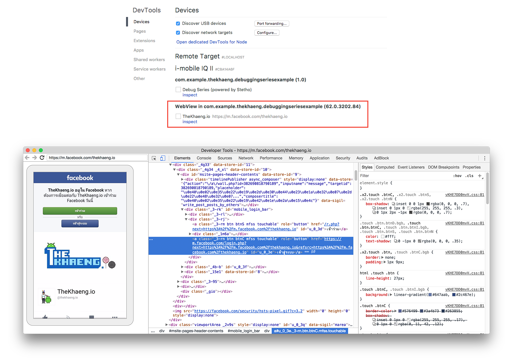
